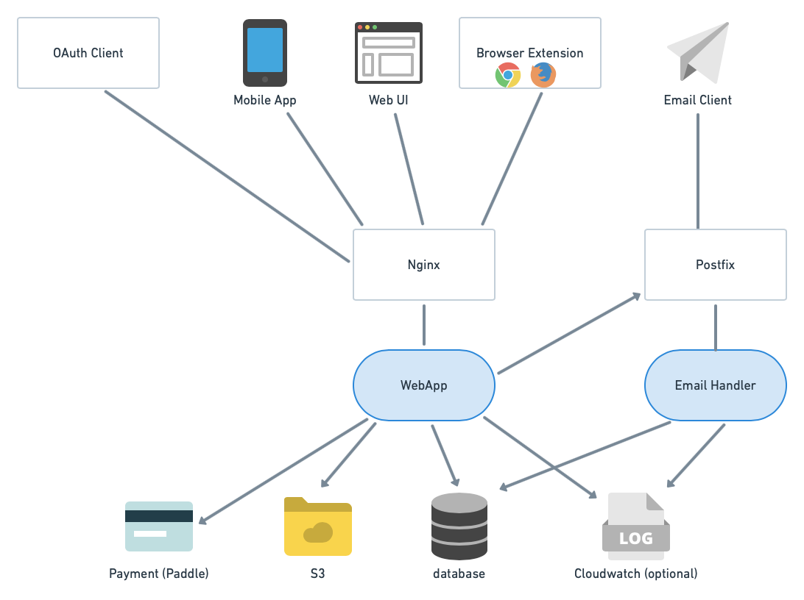

Thanks for taking the time to contribute! 🎉👍

Before working on a new feature, please get in touch with us at dev[at]simplelogin.io to avoid duplication.
We can also discuss the best way to implement it.

The project uses Flask, Python3.7+ and requires Postgres 12+ as dependency.

## General Architecture

<p align="center">
    
</p>

SimpleLogin backend consists of 2 main components:

- the `webapp` used by several clients: the web app, the browser extensions (Chrome & Firefox for now), OAuth clients (apps that integrate "Sign in with SimpleLogin" button) and mobile apps.

- the `email handler`: implements the email forwarding (i.e. alias receiving email) and email sending (i.e. alias sending email).

## Install dependencies

The project requires:
- Python 3.7+ and [poetry](https://python-poetry.org/) to manage dependencies
- Node v10 for front-end.
- Postgres 12+

First, install all dependencies by running the following command.
Feel free to use `virtualenv` or similar tools to isolate development environment.

```bash
poetry install
```

On Mac, sometimes you might need to install some other packages via `brew`:

```bash
brew install pkg-config libffi openssl postgresql
```

You also need to install `gpg` tool, on Mac it can be done with:

```bash
brew install gnupg
```

If you see the `pyre2` package in the error message, you might need to install its dependencies with `brew`.
More info on https://github.com/andreasvc/pyre2

```bash
brew install -s re2 pybind11
```

## Linting and static analysis

We use pre-commit to run all our linting and static analysis checks. Please run

```bash
poetry run pre-commit install
```

To install it in your development environment.

## Run tests

```bash
sh scripts/run-test.sh
```

## Run the code locally

Install npm packages

```bash
cd static && npm install
```

To run the code locally, please create a local setting file based on `example.env`:

```
cp example.env .env
```

Run the postgres database:

```bash
docker run -e POSTGRES_PASSWORD=mypassword -e POSTGRES_USER=myuser -e POSTGRES_DB=simplelogin -p 35432:5432 postgres:13
```

To run the server:

```
alembic upgrade head && flask dummy-data && python3 server.py
```

then open http://localhost:7777, you should be able to login with `john@wick.com / password` account.

You might need to change the `.env` file for developing certain features. This file is ignored by git.

## Database migration

The database migration is handled by `alembic`

Whenever the model changes, a new migration has to be created.

If you have Docker installed, you can create the migration by the following script:

```bash
sh scripts/new-migration.sh
```

Make sure to review the migration script before committing it.
Sometimes (very rarely though), the automatically generated script can be incorrect.

We cannot use the local database to generate migration script as the local database doesn't use migration.
It is created via `db.create_all()` (cf `fake_data()` method). This is convenient for development and
unit tests as we don't have to wait for the migration.

## Reset database

There are two scripts to reset your local db to an empty state:

- `scripts/reset_local_db.sh` will reset your development db to the latest migration version and add the development data needed to run the
server.py locally.
- `scripts/reset_test_db.sh` will reset your test db to the latest migration without adding the dev server data to prevent interferring with
the tests.

## Code structure

The repo consists of the three following entry points:

- wsgi.py and server.py: the webapp.
- email_handler.py: the email handler.
- cron.py: the cronjob.

Here are the small sum-ups of the directory structures and their roles:

- app/: main Flask app. It is structured into different packages representing different features like oauth,  api, dashboard, etc.
- local_data/: contains files to facilitate the local development. They are replaced during the deployment.
- migrations/: generated by flask-migrate. Edit these files will be only edited when you spot (very rare) errors on the database migration files.
- static/: files available at `/static` url.
- templates/: contains both html and email templates.
- tests/: tests. We don't really distinguish unit, functional or integration test. A test is simply here to make sure a feature works correctly.

## Pull request

The code is formatted using https://github.com/psf/black, to format the code, simply run

```
poetry run black .
```

The code is also checked with `flake8`, make sure to run `flake8` before creating the pull request by

```bash
poetry run flake8
```

For HTML templates, we use `djlint`. Before creating a pull request, please run

```bash
poetry run djlint --check templates
```

## Test sending email

[swaks](http://www.jetmore.org/john/code/swaks/) is used for sending test emails to the `email_handler`.

[mailcatcher](https://github.com/sj26/mailcatcher) or [MailHog](https://github.com/mailhog/MailHog) can be used as a MTA to receive emails.

Here's how set up the email handler:

1) run mailcatcher or MailHog

```bash
mailcatcher
```

2) Make sure to set the following variables in the `.env` file

```
# comment out this variable
# NOT_SEND_EMAIL=true

# So the emails will be sent to mailcatcher/MailHog
POSTFIX_SERVER=localhost
POSTFIX_PORT=1025
```

3) Run email_handler

```bash
python email_handler.py
```

4) Send a test email

```bash
swaks --to e1@sl.local --from hey@google.com --server 127.0.0.1:20381
```

Now open http://localhost:1080/ (or http://localhost:1080/ for MailHog), you should see the forwarded email.